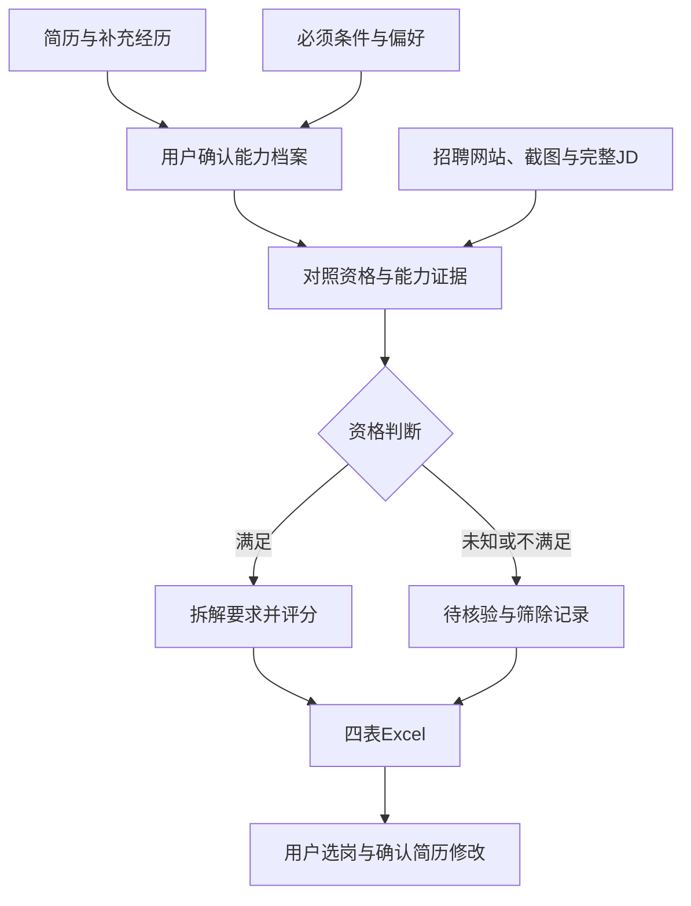

# AI辅助求职筛选与简历优化工作流

**AI-assisted Job Screening & Resume Tailoring Workflow**

将简历、招聘网页与截图转化为有证据依据的岗位比较表，减少重复整理和逐条对照JD的工作。

**当前状态：v1.1规则已编写；已完成虚构候选人 × 腾讯真实公开岗位的3条样本案例，并生成四表Excel。未测量效率提升，未验证录用效果。**

## 问题与目标

求职信息分散在招聘网站、公众号和截图中；岗位名称不能完整反映职责，每次对照简历、筛查资格和调整表达都需要重复阅读。本项目把这些任务拆成固定步骤，让AI承担整理与分析，让用户补充事实并核验结论。

主要面向非技术类（non-tech）求职方向，不预设具体行业或职能。根据用户简历和具体JD筛选市场、运营、商务、项目协调、供应链、职能支持及以业务问题为核心的分析岗位。排除以大量编程、软件研发或算法工程为核心职责的岗位；不因岗位出现SQL、Python、Excel或Power BI就自动排除，判断依据是工作目标与核心职责。

输入真实简历、补充经历、招聘材料及限定条件，输出一份四表Excel，以及针对选定岗位的简历修改建议。

## 工作流

## 用户与AI的分工

| 用户 | AI |
| --- | --- |
| 提供简历与真实经历，确认掌握程度 | 提取档案，询问影响匹配的缺失信息 |
| 指定必须条件与偏好，提供招聘材料 | 读取、保留来源、去重和核验可访问信息 |
| 检查证据与判断，决定投递顺序 | 拆解JD、解释等级、生成带公式的Excel |
| 确认简历修改中的事实 | 提出修改建议并保留待确认事项 |

## Excel交付

| 工作表 | 内容 |
| --- | --- |
| 岗位对比 | 公司、岗位、完整JD、链接、匹配分、优先级、依据与缺口 |
| 匹配明细 | 每项JD要求、经历证据、等级、权重及分项公式 |
| 待核验与筛除 | 信息缺失、资格未知、不满足条件或已关闭岗位及原因 |
| 规则与档案 | 权重、证据等级、条件、版本及用户确认的经历 |

Excel由执行工具根据规范生成，本仓库没有独立运行的表格生成程序；现提供腾讯岗位案例的实际Excel输出。工具没有文件生成能力时应明确说明，不将聊天表格称为.xlsx。生成时排序；编辑证据后公式更新分数，用户按表头重新排序。

## 匹配评分

先核对硬性资格，能力分不能抵消资格不满足。

| 维度 | 权重 |
| --- | ---: |
| 核心职责 | 40 |
| 技能工具 | 25 |
| 执行协作 | 20 |
| 行业业务 | 10 |
| 明确加分项 | 5 |

每项要求根据确认的经历评为1、0.75、0.5、0.25或0，再按权重计算。完全没有某维度要求时归一化并显示有效权重；关键JD缺失不输出总分。完整说明见[评分规则](skills/screen-job-fit/references/scoring.md)。

评分是现有证据覆盖程度，不是录用概率。默认权重与优先级阈值属于设计规则，尚未通过招聘结果校准。

## 如何使用

对能够读取仓库文件的AI工具说：

> 请读取这个仓库的 skills/screen-job-fit/SKILL.md 以及它引用的规则文件，按其流程处理我的求职任务。
>
> 先根据我的简历建立能力档案，并给我补充经历细节的机会，再读取我提供的招聘网站、截图或JD。
>
> 我的必须条件是：[填写城市、招聘类型及其他限制]。
> 我的岗位方向或偏好是：[填写目标方向；也可以不限定方向，根据我的经历筛选]。
>
> 请在非技术类岗位范围内，根据具体JD判断要求，不预设行业或职能。排除以大量编程、软件研发或算法工程为核心职责的岗位，使用数据工具的业务岗位按实际职责判断。
>
> 请输出四表Excel，保留完整JD、来源链接、匹配评分、评分依据和能力缺口。每项判断必须对应真实经历证据，缺失信息请单独列出。

随后提供简历、网站链接或截图。无法访问GitHub时上传Skill说明及三个参考文件。仅提供仓库首页链接不代表所有文件已读取，也不代表Skill已安装；让AI说明已读取的规则与缺失文件。

如使用支持本地Skill的工具，将`skills/screen-job-fit`完整文件夹安装到该工具支持的技能目录。具体安装方式取决于入口，不承诺任意AI自动识别。

## 案例与验证

- [合成演示](examples/synthetic-demo.md)：展示证据评分、资格限制和信息不完整三种处理。
- [真实案例记录模板](docs/case-record.md)：运行真实岗位后填写材料、Excel、纠错和耗时。
- [验证规范](skills/screen-job-fit/references/validation.md)：记录来源、公式、事实及效率检查。

合成演示不能代表真实求职效果。公开真实案例时只使用脱敏简历和公开岗位资料，不上传私人申请链接、联系方式或内部业务数据。

## 项目中的设计工作

本项目根据实际求职需要确定输入、用户补充环节、筛选条件、评分标准和Excel输出；将信息不足与能力缺口分开处理，并保留人工核验环节。AI辅助编写说明文件，规则由需求方提出与确认。真实运行和迭代结果在验证后更新。

## 参考与改造

参考[lgd8981289/ocr-skill](https://github.com/lgd8981289/ocr-skill)的求职模块划分和来源核验思路。本项目独立编写规则，调整为以非技术类岗位为主、不预设具体行业或职能的范围、用户提供材料的输入方式、候选人补充确认、证据评分和四表Excel交付。

本仓库不包含该仓库复制的代码、文件或截图。若后续引入其文件，需按相应许可保留版权和许可说明。

## 腾讯公开岗位案例

[案例说明与改写前后](cases/tencent-synthetic/case.md) · [虚构简历](cases/tencent-synthetic/resume-fictional.md) · [四表Excel](cases/tencent-synthetic/tencent-job-case.xlsx) · [核验记录](cases/tencent-synthetic/validation.md)

候选人全部虚构，3条JD来自腾讯官方校招。已补充虚构资格，并在明确标注的资格通过假设下给出模拟投递优先级；真实资格未知项仍保留待核验。
